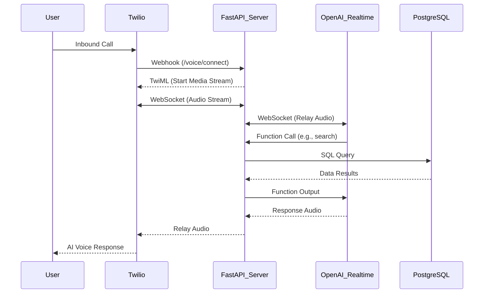

# Twilio Voice AI Assistant 📞🤖

A sophisticated, low-latency AI voice assistant for real estate, bridging **Twilio Programmable Voice** and **OpenAI Realtime API**. This system enables natural, human-like conversations for property search and listing management.

## 🌟 Key Features

-   **Human-like Conversations**: Powered by OpenAI's `gpt-4o-realtime-preview` for ultra-low latency and natural speech.
-   **Intelligent Tool Calling**: The AI can perform real-time database actions:
    -   🔍 **Property Search**: Filter by price, bedrooms, location, and amenities.
    -   🏠 **Listing Creation**: Owners can register new properties via voice.
    -   📥 **Lead Management**: Automatically create inquiries for properties.
    -   ⭐ **Favorites**: Users can save properties to their profile during the call.
-   **Role-Based Logic**: Automatically detects if the caller is a Tenant or Owner to tailor the assistant's behavior.
-   **High-Quality Audio**: Uses G.711 u-law (PCM) at 8kHz for native compatibility with Twilio Media Streams.

## 🏗️ Technical Architecture



## 🚀 Getting Started

### Prerequisites

-   Python 3.10+
-   PostgreSQL installed and running
-   Twilio Account (SID, Auth Token, and a Phone Number)
-   OpenAI API Key (Realtime enabled)
-   [ngrok](https://ngrok.com/) for local tunneling

### Installation

1.  **Clone the repository:**
    ```bash
    git clone https://github.com/Mortiz98/twilio_voice_AI_assistant.git
    cd twilio_voice_AI_assistant
    ```

2.  **Set up environment:**
    ```bash
    python -m venv venv
    source venv/bin/activate  # Windows: venv\Scripts\activate
    cp .env.example .env
    ```

3.  **Install dependencies:**
    ```bash
    pip install -r requirements.txt
    ```

4.  **Database Migration:**
    ```bash
    alembic upgrade head
    ```

### Running the App

1.  **Start the server:**
    ```bash
    uvicorn app.main:app --reload
    ```
2.  **Tunnel with ngrok:**
    ```bash
    ngrok http 8000
    ```
3.  **Update Twilio Webhook:**
    Point your Twilio number to: `https://your-url.ngrok-free.dev/webhook/voice/connect`

## 📂 Project Structure

-   `app/routers/`: Entry points for Twilio webhooks and REST APIs.
-   `app/services/`: Core logic for Media Streaming, OpenAI integration, and Function Execution.
-   `app/models/`: Database schema (Users, Properties, Inquiries).
-   `app/schemas/`: Data validation models.
-   `app/core/`: Settings and environment management.

## 🛠️ Tech Stack

-   **Backend**: FastAPI (Python 3.10+)
-   **Voice/Telco**: Twilio Programmable Voice
-   **AI**: OpenAI Realtime API (`gpt-4o-realtime`)
-   **Database**: PostgreSQL + SQLAlchemy
-   **Migrations**: Alembic

---
Developed with focus on low-latency and conversational excellence.

